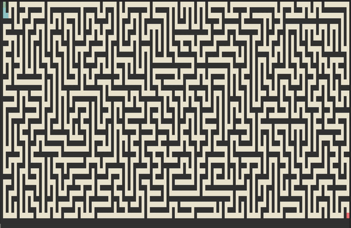

# Pathfinding

Pathfinding Implemented in C

## Demo



## Controls

Up arrow - increase speed

Down arrow - decrease speed

Left arrow - rewind

Right arrow - fast-forward

Space - pause

Enter/Return - Regenerate maze and restart

## Build & Run

```
make && ./main
```
